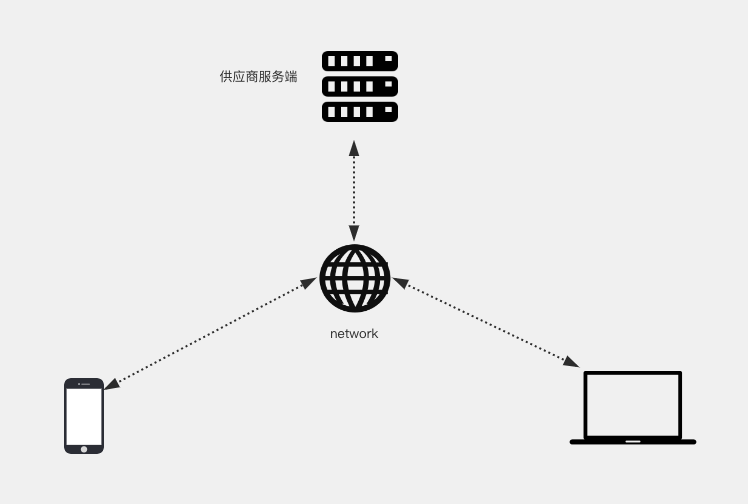
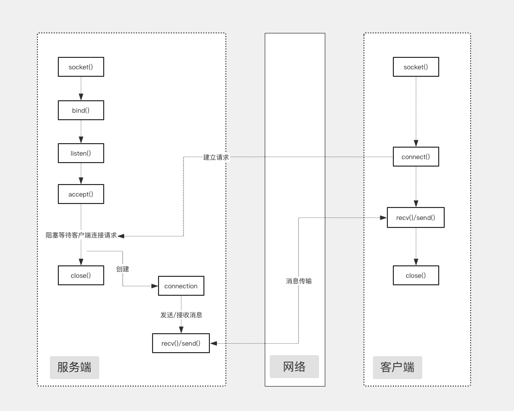

# test2

### IM（即时通讯）

IM是Instant Messaging的简称，也就是即时通讯，IM软件就是可以即时沟通聊天的软件，允许两人或多人使用网络实时的传递消息。

实现方式大致分为两种方式。

* **有服务端**，代表性产品QQ，微信 客户端将消息通过网络发送至供应商的服务端，服务端再将消息转发给对应的客户端，传输层协议使用TCP，UDP

  

* **无服务端（客户端即服务端）**，代表性产品如飞鸽传书

  应用通过网络将消息直接发送给对应的应用，传输层协议使用UDP

  

### 网络编程基础知识回顾

* **网络编程**

  网络编程就是使用IP地址，或域名，和端口连接到另一台设备上对应的程序，按照规定的协议\(数据格式\)来交换数据。

  实际编程中建立连接和发送、接收数据在语言级已经实现（**socket**），做的更多的工作是设计协议，以及编写生成和解析数据的代码，然后把数据转换成逻辑的结构显示或控制逻辑即可。

* **socket（套接字）**

  socket（套接字）是一个抽象层，可以简单的说就是tcp、udp等协议的统称。应用程序可以通过它在网络上进行数据的发送与接收，流程如下。

  

* **TCP/IP**
* **UDP**
* **知识点**

  `网络模型` `OSI参考模型` `Internet网络模型` `网络协议` `Internet的网络层协议` `Internet的传输层协议`

### 基于tcp实现简单的客户端到服务端的应答

### 基于tcp实现单服版多人聊天

### 基于tcp实现集群版多人聊天

